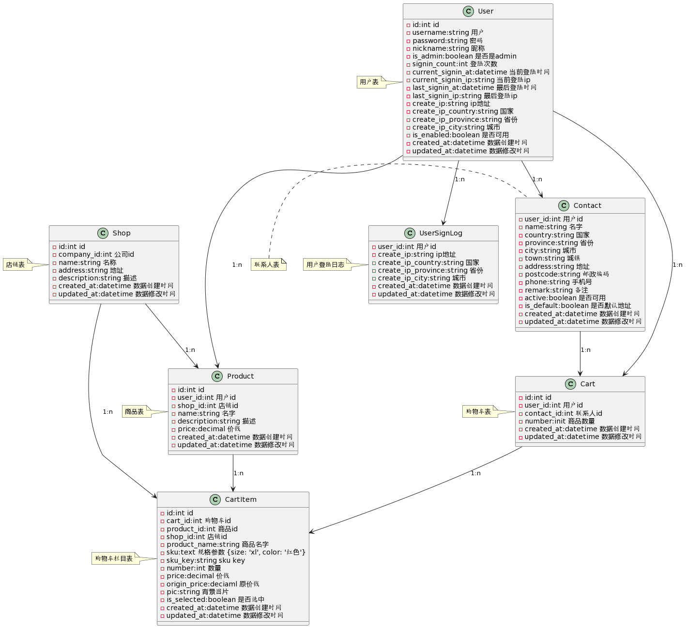

# Instruction
A Ruby Project About E-commerce

# System Requirements
* ruby 3.0.3

* rails 7.0.8

# Run
1. https://github.com/gith-u-b/backflow
2. mkdir data
3. cd data
4. git clone https://github.com/gith-u-b/ipdb
5. unzip mydata4vipday3_cn.ipdb.zip
6. bundle install
7. rails s

# 表设计


# Cart 接口设计(用户购物车管理接口)

## cart-1 购物车列表
 
### HTTP 请求 GET

GET: *http://localhost:3000/api/carts*

### Request 请求参数

无


```shell
  curl -X GET -H "token: mind" -H "X-Shop: 2" http://localhost:3000/api/carts | jq
```

### Response 响应


> 响应数据:

```json
{
  "shopcargroup": [
    {
      "id": 6887,
      "name": "高茂眼镜（厦门）有限公司",
      "meetgroups": [
        {
          "meet_reduce_id": 0,
          "products": [
            {
              "id": 3577,
              "product_id": 860,
              "product_name": "OSSAT 奥鲨时尚复古偏光太阳眼镜户外眼镜休闲驾驶眼镜",
              "number": 1,
              "price": "98.00",
              "is_selected": false,
              "created_at": "2017-10-21 11:14:06",
              "sku_format": "颜色:黑白（配蓝膜）",
              "pic_url": "http://onbakfi98.bkt.clouddn.com//1502689406238.156.jpeg",
              "limit_discount": {}
            }
          ]
        }
      ]
    },
    {
      "id": 26559,
      "name": "大连林家铺子食品股份有限公司",
      "meetgroups": [
        {
          "meet_reduce_id": 0,
          "products": [
            {
              "id": 5670,
              "product_id": 1609,
              "product_name": "林家铺子香酥黄花鱼 罐头  100g*9罐/箱     全国包邮（新疆   西藏  海南  云南等偏远地区）除外",
              "number": 1,
              "price": "88.00",
              "is_selected": true,
              "created_at": "2017-11-29 19:54:56",
              "sku_format": "",
              "pic_url": "http://onbakfi98.bkt.clouddn.com//1510129743095.0295.jpeg",
              "limit_discount": {}
            }
          ]
        }
      ]
    }
  ],
  "total_price": "88.00",
  "minus_price": "9.00",
  "order_price": "79.00"
}

```


## cart-2 删除购物车 已测试

### HTTP 请求

DELETE *http://localhost:3000/api/carts/:id*

### Request 请求参数

参数名 | 是否必需 | 描述
-----| --------| -------
id   | 是      | 商品id

```shell
  curl -i -X DELETE -H "token: mind" -H "X-Shop: 2" http://localhost:3000/api/carts/:id
```

### Response 响应

> 响应数据:

```json
{
	"status": 200,
	"msg": "删除成功!"
}
```

## cart-3 购物车添加商品 已测试

### HTTP 请求

POST *http://localhost:3000/api/carts* 

### Request 请求参数

参数名 | 是否必需 |  数据类型 | 描述
-----| --------| ------- | --------
product_id  | 是 | Integer | 商品ID
number | 是 | | Integer  | 商品数量
sku | 是 | String | 商品规格

```shell
  curl -X POST -H "token: mind" -H "X-Shop: 2" -d "cart%5Bnumber%5D=2&cart%5Bproduct_id%5D=467&cart%5Bsku%5D%5Bcolor%5D=%E7%BA%A2%E8%89%B2" http://localhost:3000/api/carts | jq
```

### Response  响应

> 响应数据:

```json
{
	"status": 200,
	"msg": "添加成功!"
}
```

## cart-4 修改数量 已测试

### HTTP 请求

PUT *http://localhost:3000/api/carts/:id/edit_number*

### Request 请求参数

参数名 | 是否必需 | 描述
-----| --------| -------
id   | 是      | 购物车ID
number | 是 | 商品数量

```shell
  curl -i -X PUT -H "token: mind" -H "X-Shop: 2" http://localhost:3000/api/carts/:id/edit_number
```

### Response 响应

> 响应数据:

```json
{
  "status": 200,
  "msg": "操作成功!"
}
```

## cart-5 清空购物车

### HTTP 请求

POST *http://localhost:3000/api/carts/clear_cart*

### Request 请求参数
无

```shell
  curl -X POST -H "token: mind" -H "X-Shop: 2" http://localhost:3000/api/carts/clear_cart | jq
```

### Response 响应

> 响应数据:

```json
{
  "status": 200,
  "msg": "清除成功!"
}
```

## cart-6 购物车订单确认

### HTTP 请求

GET *http://localhost:3000/api/carts/confirm*

### Request 请求参数

参数名 | 是否必需 |  数据类型 | 描述
-----| --------| ------- | --------
balance_pay  | 否 | Boolean | 是否开启余额支付
password | 否 | | string  | 开启余额支付时需传此参数

```shell
  curl  -H "token: mind" http://localhost:3000/api/carts/confirm | jq
```

### Response 响应

> 响应数据:

```json
{
  "shopcargroup": [
    {
      "id": 26559,
      "name": "大连林家铺子食品股份有限公司",
      "shop_type": -1,
      "delivery_price": "0.00",
      "meetgroups": [
        {
          "meet_reduce_id": 0,
          "products": [
            {
              "id": 5670,
              "product_id": 1609,
              "product_name": "林家铺子香酥黄花鱼 罐头  100g*9罐/箱     全国包邮（新疆   西藏  海南  云南等偏远地区）除外",
              "number": 1,
              "price": "88.00",
              "is_selected": true,
              "created_at": "2017-11-29 19:54:56",
              "sku_format": "",
              "pic_url": "http://onbakfi98.bkt.clouddn.com//1510129743095.0295.jpeg",
              "limit_discount": {}
            }
          ]
        }
      ],
      "number": 1,
      "sum_price": "88.00",
      "minus_price": "9.00"
    }
  ],
  "total_price": "88.00",
  "contact": {
    "id": 359,
    "name": "Sai",
    "address": "国仕汇9号楼3单元802",
    "mobile": "19911992123",
    "is_default": true,
    "locations": "北京市昌平区国仕汇1号楼1单元102",
    "default_name": "是"
  },
  "sum_freight_price": "0.00",
  "minus_price": "9.00",
  "pay_price": "79.00",
  "amount": 1.1 #用户总余额
  "pay_amount": 1.1 #用户可用余额
}
```